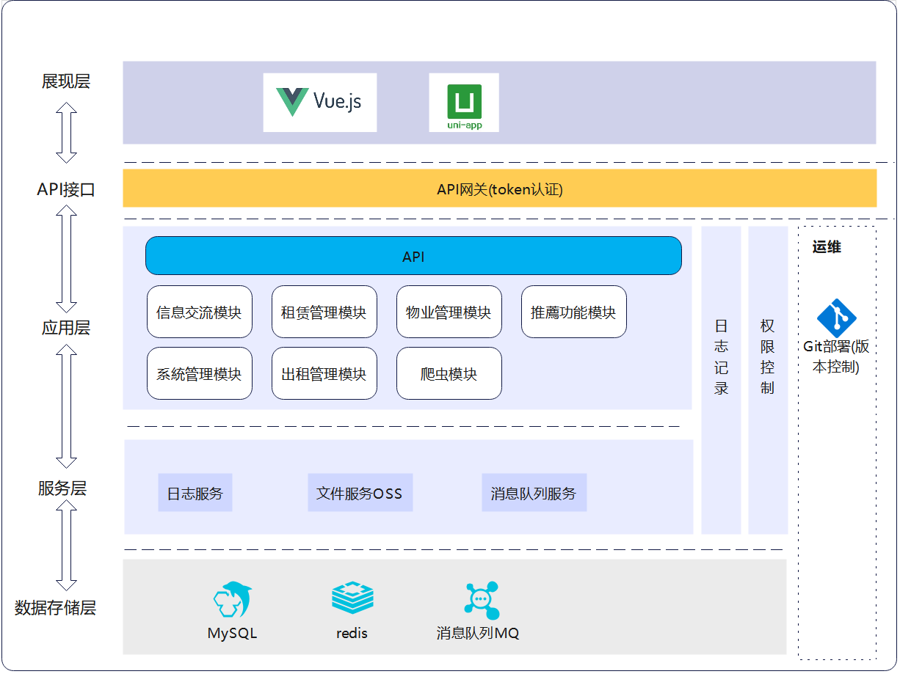
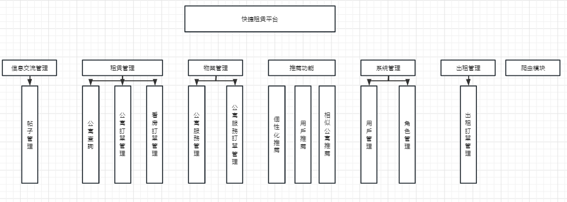
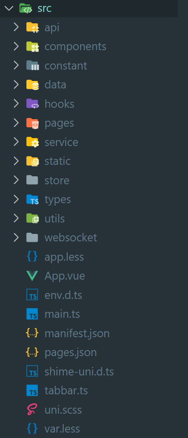
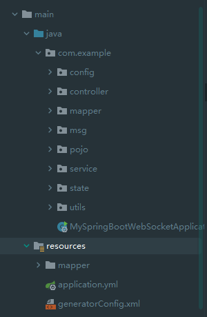
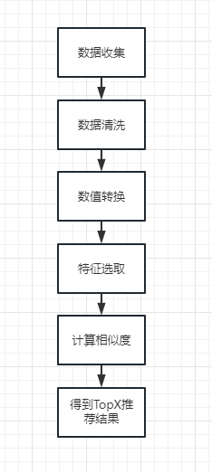

<div align="center">
    
</div>

<h1 align="center">
    Dan
</h1>

<h3 align="center">
    Housing-Recommend-System
</h3>

## 项目介绍
公寓/房屋推荐系统，论文题目为基于小程序的快捷租赁平台,系统主要是一个推荐系统,包括基于用户的协同过滤去推荐用户和相似公寓,也有基于内容的推荐算法.系统也有完整的业务.
题外话:这应该是我最后写的一个 APP 了吧,哈哈,3年的 CRUD ,这里也算是记念下大学几年学到的东西吧...

## 摘要
推荐系统是一种信息过滤系统，旨在解决人们所面临着的信息冗余、过载的问题.随着互联网上房源信息越来越多,人们从大量的房产信息中找到自己需要的信息也变得 越来越困难,传统的搜索引擎具有明确的目的性，但需要用户提供明确的信息，而推荐系统可以发掘信息，主动给用户推荐满足用户兴趣的信息。本系统使用的是混合推荐算法,一个是基于内容推荐算法,利用房源的面积、户型、价格等属性字段去计算不同房源之间的相似度.另外一个是基于用户的协同过滤算法,根据和你有相同兴趣的人去推荐你可能喜欢的公寓.最后把这两个结果混合起来再返回推荐结果.本系统还有相似推荐和用户推荐,分别使用基于内容和基于用户的协同算法去推荐相似公寓和用户可能感兴趣的用户.

## 系统整体架构

<div class="container" style="display:flex;flex-direction:column;gap:10px">
<div >
本系统主要分为4层展现层、应用层、服务层和数据存储层.
</div>
<div>
展现层: 因为本系统也包括后台页面和App页面,而这两个页面都是用Vue来写,只是为了写App端需要用到uniapp来转换为微信小程序的代码.
</div>
<div>
服务层: 利用divython实现余弦相似度算法计算房源之间相似度,再使flask搭建接口服务供后台调用，服务端则使用 SpringBoot 框架搭建 Restful API 接口.
</div>
<div>
数据层: 以 Mysql 数据库作为支撑，存储关系型数据，同时使用 Redis 缓存作为辅 助来存储推荐结果，从而提高推荐系统对于前端的响应速度。
</div>
<div>
另外,在项目前期利用爬虫程序爬取房源信息，并进行了数据清洗、去重等工作，从而为数据的特征提取、处理打下了一个良好的基础.开发工具主要使用了 JetBrains 公司开发的 IntelliJ IDEA 与 divycharm、vscode 、微信开发者工具、divostMan 接口测试工具.
</div>

</div>

## 系统功能模块

<div class="container" style="disdivlay:flex;flex-direction:column;gap:8px">
<div >
    系统功能模块划分为信息交流模块、租赁管理模块、物业管理模块、推荐功能模块、系统管理模块、出租管理模块和爬虫模块.
</div>
</div>

## 展示层
### 页面结构

<div class="container" style="display:flex;flex-direction:column;gap:5px;margin-bottom:10px">
<div>Api:          接口配置以及getpost方法的封装</div>
<div>Comdivonents: 公用组件</div>
<div>Constant:     常量</div>
<div>data:         数据列表(如小区列表)</div>
<div>hooks:        vue3 hook</div>
<div>pages:        页面</div>
<div>service:      业务接口</div>
<div>static:       静态图片</div>
<div>store:        页面</div>
<div>types:        类型(包括业务类型和组件类型)</div>
<div>utils:        工具函数(日期..)</div>
<div>tabbars:      配置tabbar</div>
</div>

```typescript

// 配置 RequestConfig /src/api/config.ts

const backendLocalHost = 'http://127.0.0.1:8087/'
const baseUrl = backendLocalHost
const algrithomUrl = '127.0.0.1:8088'
```

```typescript
// 配置 Request - Post,Get,UploadImage /src/api/request.ts

import { baseUrl } from "@/api/config";
import { AxiosResponse } from 'axios'
import axios from 'axios'
type State = "SUCCESS" | "ERROR"
type Response<T> = {
    result:T,
    state:State,
    code:number,
    message:string
}
type BaseFormData = {
    path:string
}
type IFormData = {[key:string]:any} & BaseFormData

export function get<T extends Object>(url:string,data?:Object):Promise<Response<T>>{
    ...
}


export function uploadImage(filePath:string[],formData?:IFormData,progress?:boolean):Promise<Array<Response<{path:string}>>>{
    ...
}
```

```typescript
// 配置 Tabbars - 动态tabbars  /src/tabbar.ts

type TabBar = Array<{
    pagePath:string,
    iconPath:string,
    selectedIconPath:string,
    text:string
}>
// 租客页面
const tenant:TabBar = []
// 业主页面
const owner:TabBar = []
```

```json 
# /src/pages.json

//   除了上面配置页面之外,还要在这里配置

"tabBar": {
    "list": [
        {
            "pagePath": "pages/tabbar/HomeContainer"
        }
    ],
```

## 应用层
### Springboot后台接口
#### 后台文件目录

<div>

</div>
<div class="container" style="display:flex;flex-direction:column;gap:8px;margin-bottom:10px">
    <div >
    本系统中使用到的Spring Boot框架主要是为搭建Restful形式的API接口，来为小程序端和前端提供数据传输能力.项目大致分为了Controller层、Service 层、Mapper层. Controller 层作为请求控制器负责请求的接受并调用相应的service方法将处理结果响应给前端；service层是具体的业务逻辑，负责实现相应的业务操作；Mapper层是数据持久层，专注于与数据库的交互.
    </div>
    <div >
    另外还有Msg、State 和 utils文件夹, Msg 主要是一些作接口返回值的类型,State 则是某类中包括的状态值 ( 如订单状态 ) , utils是工具类,包括字符串Ids 转为 int数组、数据生成、日期转换和JSON转换等.
    </div>
</div>

#### 系统中的Controllers

- UserController（用户控制器类）
  1)  用户注册
  2)  用户登陆
  3)  检查是否已follow
  4)  获取followList
  5)  基本增删改查

- UploadController（上传控制器类）
  1)  上传图片

- ServiceController（服务控制器类）
  1)  获取该服务的留言
  2)  留言
  3)  创建/更新订单
  4)  基本增删改查

- RoomController（公寓控制器类）
  1)  根据用户ID获取推荐结果
  2)  根据不同条件获取公寓
  3)  获取热门公寓
  4)  获取所有社区
  5)  基本增删改查

- RoomBookingController（预约看房控制器类）
  1)  根据用户ID获取所有订单
  2)  创建/更新看房订单
  3)  基本增删改查

- RentInfoController（租赁控制器类）
  1)  根据用户ID获取所有订单
  2)  创建/更新公寓订单
  3)  基本增删改查

- PostController（帖子控制器类）
  1)  根据用户ID获取所有订单
  2)  上传帖子
  3)  点赞/取消
  4)  获取帖子评论
  5)  基本增删改查

- LeaseController（租赁控制器类）
  1)  根据用户ID获取所有订单
  2)  创建/更新出租订单
  3)  基本增删改查

- DataUploadController（数据上传控制器类）
  1)  上传用户行为


### 推荐算法
#### 算法实现过程
<!--  -->

1. 数据收集
   因为python处理算法的库都是要先转成csv的,所以第一步要从数据库里获取数据,井转成CSV格式,最后存到本地.
   ```python
    class DataLoader:
        def loadInfoFromMysql(fileName, tableName):
            cursor = db.db.cursor()
            sql = f"select * from {tableName}"
            cursor.execute(sql)
            des = cursor.description
            title = [each[0] for each in des]
            # 拿到数据库查询的内容
            result_list = []
            for each in cursor.fetchall():
                result_list.append(list(each))

            # 保存成dataframe
            df_dealed = pd.DataFrame(result_list, columns=title)
            df_dealed.to_csv(f"../dataset/{fileName}_data.csv", index=False, encoding='utf_8')

   ```
2. 数据清洗
   数据中某些特征可能存在多量的空值,还有因为爬虫原因,可能爬取了相同的数据,所以这里需要去重和去掉重复值较多的特征.
   ```python
    class DataCleaner:
        def clean(fileName):
            path = f'../dataset/{fileName}.csv'
            # 读取
            df = pd.DataFrame(path)
            # 行列数
            row, col = df.shape
            # 删除缺失值较多的列
            rowThreshold = int(row / 2)
            df.dropna(axis=1, thresh=rowThreshold)

            # 删除重复行
            df.drop_duplicates('title', inplace=True)
            # 写入
            df.to_csv(path)
   ```

3. 数值转换
   经过数据清洗这一过程后,我们还要把一些非数值型转换成数值型,比如公寓的朝向.One-Hot编码的核心思想是将分类的变量值作为二进制向量进行表示.
   ```python
    class FeatureEngineering:
        def onehot(dataFrame: DataFrame):
            """
            one - hot
            :param dataFrame: 任意df
            :return:
            """
            return pd.get_dummies(dataFrame)
   ```

4. 归一化
   对原始数据缩放到 0-1 之间，是线性变换。也叫最大最小标准化，离散标准化。公寓数据中比如“价格”，若不经过量化处理直接参与运算，则容易导致计算结果偏差较大，因而需要标准化处理。标准化处理的具体过程是使用某个数值与该字段最小值的差除以该字段的区间长度，相当于进行了一次区间放缩。
   ```python
    class FeatureEngineering:
        def minMaxStandardization(codeResult: DataFrame) -> ndarray:
            """
            归一化
            :param codeResult: 经过one-hot 转化的
            :return: ndarray
            """
            return MinMaxScaler().fit_transform(codeResult)
    ```
5. 特征选取
   方差选择法,原理是先计算各个特征的方差，然后根据阈值，选择方差大于阈值的特征.这里主要是过滤掉某个所有取值相同的特征
   
   ```python
    class FeatureEngineering:
        def featureSelectionByFilter(df: DataFrame):
            # 创建 VarianceThreshold

            selector = VarianceThreshold()
            # selector = VarianceThreshold()
            selector.fit_transform(df)
            # 开始过滤方差为x的
            # 首先获取列ids并根据列ids获取列标签
            # 最后过滤
            mask = selector.get_support()
            maskPd = pd.DataFrame(mask)
            ori_columns = df.columns

            ori_columns_pd = pd.DataFrame(ori_columns)
            filterDf = maskPd[maskPd[0] == False]

            filterIds = filterDf.index.tolist()
            title_list = ori_columns_pd.loc[filterIds].values.tolist()
            filter_title_list = list(map(lambda x: x[0], title_list))
            filter_df = df.drop(labels=filter_title_list, axis=1)
            return filter_df
    ```
6. 计算相似度
- 余弦相似度算法
  
    <div style="margin-bottom:10px">
    余弦相似度算法是一种常见的计算物品之间相似度的算法，其核心思想是对两个向量相乘再除以两个向量的模长之积，其比较适合高维度的数据计算。余弦相似度的结果小于1，越接近1代表余弦角度越小，即两个物品向量越相似；反之，数值越远离1，则说明两个向量之间的相关性较低.
    </div>

    余弦相似度公式为：
    <div style="margin-bottom:10px">
    <image style="display:flex" src="https://camo.githubusercontent.com/90c00464ee7ce058bafe27b56da255e0da7220baa74f78e06bb36d43c9e185cc/687474703a2f2f7777312e73696e61696d672e636e2f6c617267652f303036534673616d6c79316773336f7077797a756e6a333063323033356139782e6a7067"/>
    房源信息一般信息量比较大，包含价格、面积、户型、装修类型等多个属性信息，本系统在计算房源之间相似度的时候，为提高相似度的准确性，使用了27个字段来作为公寓向量分量参与计算。
    </div>

    ```python
    
    def cosineSimilarityRoomRes(city: str):
        # 读取文件
        data = pd.read_csv('../dataset/room_dataset_2.csv')
        dataframe = pd.DataFrame(data=itemSimilarity[0:, 0:])
        dataframe.to_csv(f'../trainedData/{cities[city]}_cosineRes_1.csv')
        print(f'the calculation of {cities[city]} has done')
    ```

- Jaccard相似度
  
    <div style="margin-bottom:10px">
    Jaccard距离是另一个量的函数，这个量被称为Jaccard相似度。根据定义，集合S和T的Jaccard相似度是S和T的交集大小与它们的并集大小之比
    </div>

    Jaccard相似度公式为：
    <div style="margin-bottom:10px">
    <image style="display:flex" src="user_base.png"/>
    </div>

    ```python
    def calculateBrowseHistorySimilarity(fileName,savePath):
        data: DataFrame = pd.read_csv(fileName)
        userSimilarity: ndarray = 1 - pairwise_distances(data.values.astype(bool), metric='jaccard')
        df = pd.DataFrame(data=userSimilarity)
        df.to_csv(savePath)
    ```
   
7. 获取相似公寓结果
```python
def getTopXSimilarityItems(city: str, houseId: int, num=5):
    # 读取矩阵 和 对应的id
    resDF = roomFileCache[city]['trainedData']
    # 把id转为list
    realIds = roomFileCache[city]['ids']['id'].tolist()
    # 获取对应行的index
    houseIdIndex = realIds.index(houseId)
    # 获取对应的行
    firstRow: ndarray = resDF.values[houseIdIndex]
    # 把对应的行转为list
    res: list = firstRow.tolist()
    # 删除首列 -- 序号
    del (res[0])
    # 浅拷贝并排序
    originRes = res.copy()
    res.sort(reverse=True)
    # ids
    ids = []
    originIds = [houseIdIndex]
    values = []

    for index in range(0, num + 1):
        target = res[index]
        targetIndex = originRes.index(target)
        values.append(target)
        if realIds[targetIndex] != houseId:
            ids.append(realIds[targetIndex])
            originIds.append(targetIndex)

    return ids

```

#### 推荐接口
1. 接口化
   
    推荐模块选用了Flask作接口化,对推荐函数加上@app.route便可以供后台调用
    ```python
    @app.route('/expect/room/<int:userId>/<int:page>')
    def getItemByTopXSimilarityUser(userId, page):
        ...
    ```

2. 设置缓存
    ```python
    # cache.py
    roomFileCache = {
        '武汉': {
            'ids': None,
            'trainedData': None
        },
        ...
    }

    followFileCache = {
        'userSimilarity': None,
        'followDataset': None
    }

    cfFileCache = {
        'browse_history': None,
        'user_based': None
    }
    ```

#### 自动化
模型是每隔24小时训练一次,所以我们需要一个定时器,而刚好Flaks有一个定时器叫APScheduler.而这里可以把先前的处理过程简化为三个阶段,分别为数据收集阶段,预处理阶段和训练阶段.


```python
from flask_apscheduler import APScheduler
scheduler = APScheduler()
scheduler.api_enabled = True
scheduler.init_app(app)

@scheduler.task('cron', id='data_collection_stage', day='*', hour='5', minute='50', second='0')
def dataCollection():
    RecommendModel.DataLoader.loadInfoFromMysql(
        fileName=DataMap.BROWSEHISTORY[DataMapKey['fileName']],
        tableName=DataMap.BROWSEHISTORY[DataMapKey['tableName']]
    )

@scheduler.task('cron', id='preprocessing_stage', day='*', hour='5', minute='55', second='0')
def preprocessing():
    # 基于内容
    RecommendModel.PreProcessor.transformRoomToDataSet()

    # 基于用户的协同过滤
    RecommendModel.PreProcessor.transformFollowsToDataSet()
    RecommendModel.PreProcessor.transformBrowseHistoryToDataSet()

@scheduler.task('cron', id='train_stage', day='*', hour='6', minute='0', second='0')
def Training():
    RecommendModel.trainingCityDataByCity(city='武汉')
    RecommendModel.trainingBrowseHistoryData()
    RecommendModel.trainingFollowData()

scheduler.start()
```

## 数据层
### MySQL
主要利用MySQL来存储房源数据、用户个人数据、用户收藏数据、用户浏览记录，数据库存储引擎选用的是InnoDB，编码为UTF-8。

在SpringBoot项目中的application.yaml中进行数据源的配置，其中需要设置数据库连接URL，数据库用户名、数据库密码，数据库连接驱动（一般推荐使用com.mysql.cj.jdbc.Driver）。同时，为防止日期格式等出现错误或乱码问题还需要设置时区与日期格式。
```java
# 数据源配置 
spring:
  datasource:
    driver-class-name: com.mysql.cj.jdbc.Driver
    url: jdbc:mysql://localhost:3306/house?characterEncoding=utf8&useSSL=false&serverTimezone=UTC&rewriteBatchedStatements=true&allowPublicKeyRetrieval=true
    username: root
    password: 123456
    type: com.alibaba.druid.pool.DruidDataSource
    filters: stat
    initial-size: 2
    max-idle: 10
    min-idle: 1
    max-active: 20
```

E-R图:
<image src='er.png' />

## 效果展示
- 首页
<image style="margin-bottom:10px" src='UI/1.png' />

- 看房单
<image style="margin-bottom:10px" src='UI/2.png' />

- 服务
<image style="margin-bottom:10px" src='UI/3.png' />

- 社区
<image style="margin-bottom:10px" src='UI/4.png' />

- 公寓详情
<image style="margin-bottom:10px" src='UI/6.png' />

- 服务详情
<image style="margin-bottom:10px" src='UI/7.png' />

- 服务订单
<image style="margin-bottom:10px" src='UI/8.png' />

- 服务订单详情
<image style="margin-bottom:10px" src='UI/9.png' />

- 业主首页
<image style="margin-bottom:10px" src='UI/10.png' />


- 案例详情
<image style="margin-bottom:10px" src='UI/11.png' />


- 出租
<image style="margin-bottom:10px" src='UI/12.png' />


## 备注

数据来源于安居客，数据不得商用，仅供科研学习使用！

小程序中使用到高德地图SDK,需要自己申请App key。

## 感言
emm,现在是2023/4/17,毕设已经完成了...历时2个月,虽说一个星期玩3天hhh,但每天基本都花5个小时去写,CRUD是真不想再写了,可能以后想写也没机会再写了.准备毕业啦,步入社会了,希望自己能找到份好工作吧.感觉对这个有帮助的可以给个Star,我想可能是跟我一样做毕设的人才有可能找到吧.
